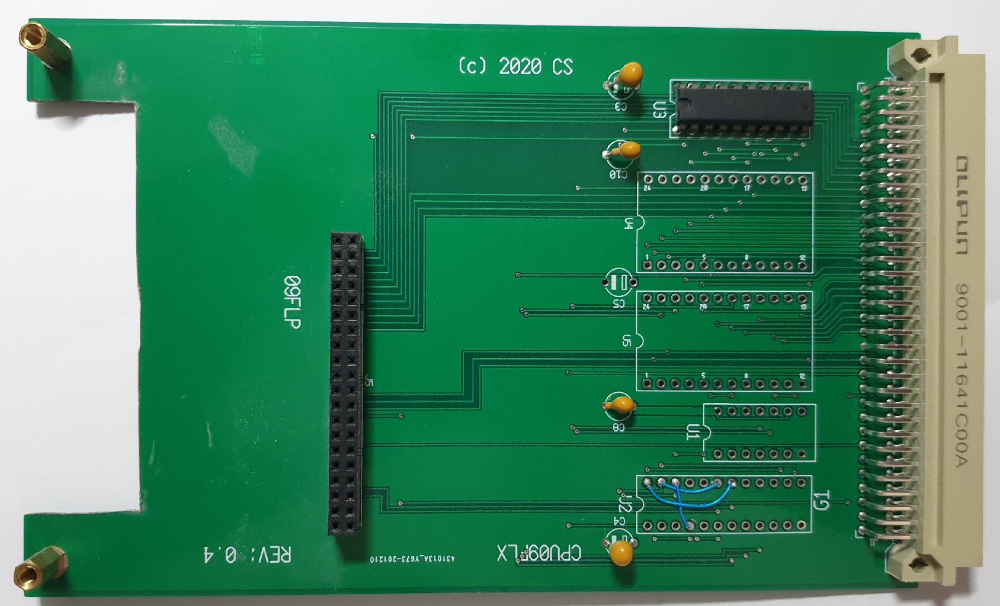

Here is the CPU09FLX board

Provides:
* address decoding for FEXXX / XEXXX
* 2K RAM socket
* 2K (EP)ROM socket
* 40 pole connector with CPU09GPP layout
* flexible IO decoding due to GAL

This board allows a very compact FLEX system to be build. With the CPUXXCMI you
would have: 2K Monitor ROM, 68X02/68X09/63X09 CPU, 64K RAM, Console ACIA, baud 
clock generator fully buffered bus signals.

The mini-backplane CPU09BP3 would be more then plenty for such a system.

