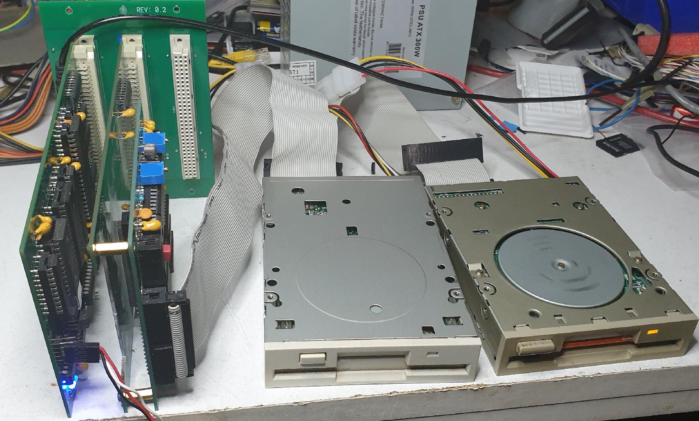

# FLEX
Some spin-off items from the UniFLEX project for FLEX (r)

2021-11-03: Photo is of a minimal FLEX (r) hardware system for floppy
drives.

CPUXXCMI  (CPU, SBUG ROM, system RAM, console port), CPU09FLX (minimally 
populated), 09FLP (supports 3.5", 5.25" and 8" drives in single/double/high
density)

Ofcourse, one can choose one of the smaller backplanes

It is possible that github cannot show a pdf file because it is a compressed pdf.
A download of it can always be read with Adobe Reader.

